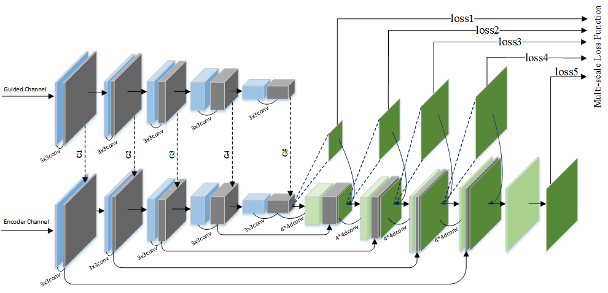

# MGANet
PyTorch implementation of "MGANet: A Robust Model for Quality Enhancement of Compressed Video" 

- [arXiv](http://arxiv.org/pdf/1811.09150)      
- [Data Compression Conference (DCC2020)](https://www.cs.brandeis.edu/~dcc/Call.html)

<p align="center">
     <br />
    <em> The proposed MGANet framework</em>
</p>

<p align="center">
     <br />
    <em> The guided encoder-decoder subnet </em>
</p>


## Installation
The code was developed using Python 3.6 & PyTorch 0.4 & CUDA 8.0. There may be a problem related to software versions. To fix the problem, you may look at the implementation in MGANet files and replace the syntax to match the new PyTorch environment. 

## Code v1.0
Currently, we release our research code for testing. It should produce the same results as in the paper under LD and AI configurations and frame number 3.
## Test
* Pretrained models can be downloaded from this link!
```
https://drive.google.com/drive/folders/1xROBCUHgIX-3zqKMSHwKFEK8udIEicl1?usp=sharing
```
* It would be very easy to understand the test function and test on your own data.
* An example of test usage is shown as follows:
```bash 
python MGANet_test_AI37.py --gpu_id 1 --is_training False
```
## Train and Data
* We will update the training code and database for TUs' partition of compressed video by HEVC for training and better reading after recent paper deadline.
## Video Results
* [Here](http://arxiv.org/pdf/1811.09150) we provide quality enhancement results of compressed video for 18 widely used sequences for visual and quantitative comparisons.
## Citation

If you use any part of our code, or our method is useful for your research, please consider citing:

```
@article{MGANET2018,
  author={Xiandong, Meng and Xuan, Deng and Shuyuan, Zhu and Shuaicheng, Liu and Chuan, Wang and Chen, Chen and Bing, Zeng},
  title={MGANet: A Robust Model for Quality Enhancement of Compressed Video},
  journal={arXiv:1811.09150},
  year={2018}
}

@article{Meng_DCC2020,
  author={Xiandong, Meng and Xuan, Deng and Shuyuan, Zhu and Shuaicheng and Bing, Zeng},
  title={Flow-Guided Temporal-Spatial Network for HEVC Compressed Video Quality Enhancement},
  journal={Data Compression Conference (DCC)},
  year={2020}
}
```
## Contact
We are glad to hear if you have any suggestions and questions. 
Please send email to xmengab@connect.ust.hk
